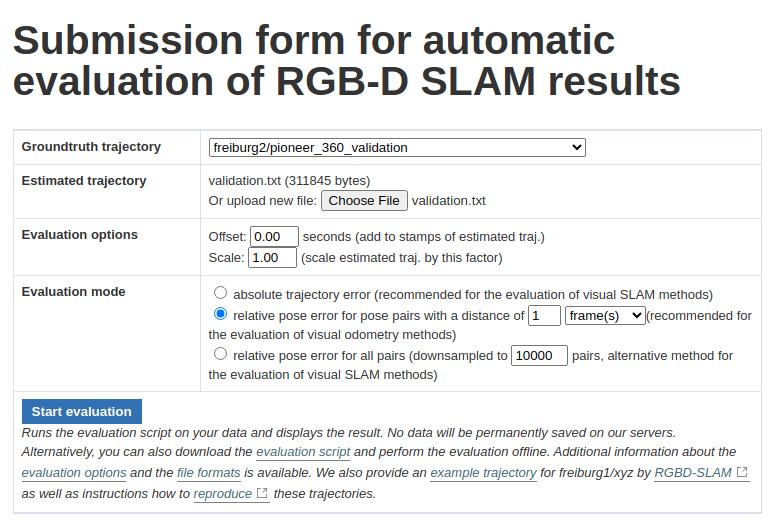

# vo_lstm

## Installation

```shell
$ pip3 install -r requirements.txt
```

## Dataset

The dataset employed in this Visual odometry demo is the [TUM dataset](https://cvg.cit.tum.de/data/datasets/rgbd-dataset/download). Specifically, the following sequences are used to train the model:

- [freiburg2_pioneer_360](https://cvg.cit.tum.de/rgbd/dataset/freiburg2/rgbd_dataset_freiburg2_pioneer_360.tgz)
- [freiburg2_pioneer_slam](https://cvg.cit.tum.de/rgbd/dataset/freiburg2/rgbd_dataset_freiburg2_pioneer_slam.tgz)
- [freiburg2_pioneer_slam2](https://cvg.cit.tum.de/rgbd/dataset/freiburg2/rgbd_dataset_freiburg2_pioneer_slam2.tgz)
- [freiburg2_pioneer_slam3](https://cvg.cit.tum.de/rgbd/dataset/freiburg2/rgbd_dataset_freiburg2_pioneer_slam3.tgz)

You have to download and extract the each sequence into the dataset/train directory.

## Train

First, configure the params to train the model. Check them in the [params.py](params.py) file. Then, run the training script.

```shell
$ python3 train.py
```

## Validation

The [TUM online validation tool](https://cvg.cit.tum.de/data/datasets/rgbd-dataset/online_evaluation) is used to validate the model. For this aim, the following sequences can be used. Download and extract this sequence into the dataset/val directory.

- [freiburg2_pioneer_360_validation](https://cvg.cit.tum.de/rgbd/dataset/freiburg2/rgbd_dataset_freiburg2_pioneer_360_validation.tgz)
- [freiburg1_room_validation](https://cvg.cit.tum.de/rgbd/dataset/freiburg1/rgbd_dataset_freiburg1_room_validation.tgz)
- [freiburg3_walking_rpy_validation](https://cvg.cit.tum.de/rgbd/dataset/freiburg3/rgbd_dataset_freiburg3_walking_rpy_validation.tgz)

Before using the validation tool, generate the position and orientations for the validation sequence. Then, upload the generated file and configure the validation tool setting the sequence length that is the frames per pose.

```shell
$ python3 val.py
```



## Results

Put your results here showing the graphs got from [TUM online validation tool](https://cvg.cit.tum.de/data/datasets/rgbd-dataset/online_evaluation).

### Results 1
#### Params:
**LSTM**
hidden_size = 500, num_layers = 2, bidirectional = False, lstm_dropout = 0.2.

**dataset**
sequence_length = 2, batch_size = 32.

**train**
learning_rate = 0.001, epochs = 5.

Loss = \[0.004410954854336689, 0.004378075456109152, 0.004340186298302962, 0.004356362351896181, 0.004372523757036271\]

**val**
- rgbd_dataset_freiburg1_room_secret


- freiburg3_walking_rpy_validation


### Results 2
#### Params:
**LSTM**
hidden_size = 500, num_layers = 3, bidirectional = True, lstm_dropout = 0.2.

**dataset**
sequence_length = 2, batch_size = 32.

**train**
learning_rate = 0.001, epochs = 2.

Loss = \[0.004410954854336689, 0.004378075456109152\]

**val**
- rgbd_dataset_freiburg1_room_secret
  


- freiburg3_walking_rpy_validation
  


### Results 3
#### Params:
**LSTM**
hidden_size = 500, num_layers = 2, bidirectional = False, lstm_dropout = 0.2.

**dataset**
sequence_length = 2, batch_size = 32.

**train**
learning_rate = 1e-4, epochs = 5.

Loss = \[0.004411576853969812, 0.0.004347135645659198, 0.004248584973697275, 0.004054408310991924, 0.003642445802291728\]

**val**
- rgbd_dataset_freiburg1_room_secret
  

